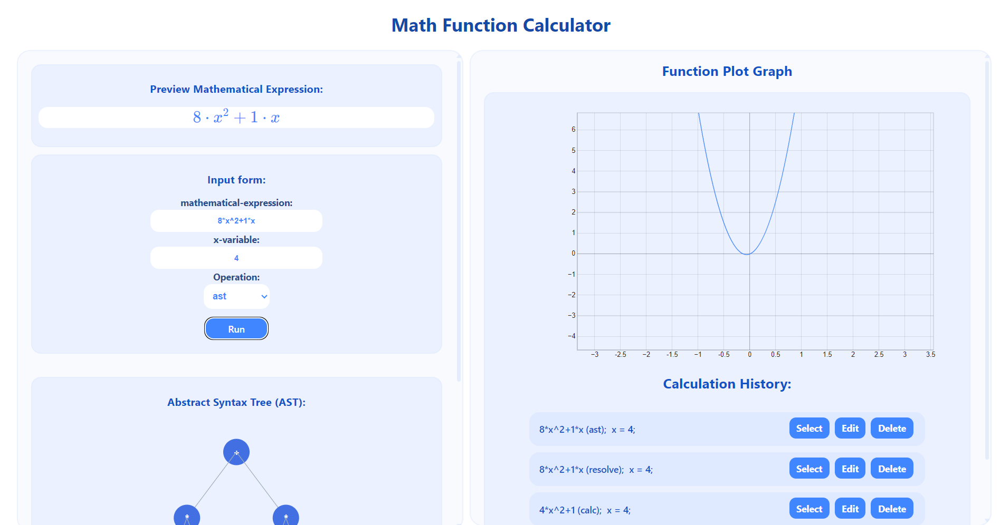

# Math Function Calculator App

---

### Screenshots

#### Startseite



---

# Inhaltsverzeichnis:

1. [Screenshots](#screenshots)  
   1.1 [Startseite](#startseite)

2. [Verwendete Sprachen/Tools](#verwendete-sprachen-tools)  
   2.1 [Front-End](#front-end)  
   2.2 [Back-End](#back-end)

3. [Installation](#installation)  
   3.1 [Projekt klonen](#1-projekt-klonen)  
   3.2 [Abhängigkeiten installieren](#2-abhängigkeiten-installieren)  
   3.3 [Umgebungsvariablen konfigurieren](#3-umgebungsvariablen-konfigurieren)  
   3.4 [Backend-Server starten](#4-backend-server-starten)  
   3.5 [Frontend-Anwendung starten](#5-frontend-anwendung-starten)  
   3.6 [Datenbank einrichten (optional)](#6-datenbank-einrichten-optional)  
   3.7 [Anwendung testen](#7-anwendung-testen)

4. [Funktionalität](#funktionalität)  
   4.1 [Input Form](#input-form)  
   4.2 [Preview Mathematical Expression](#preview-mathematical-expression)  
   4.3 [Function Plot Graph](#function-plot-graph)  
   4.4 [Calculation History](#calculation-history)

## Verwendete Sprachen/Tools:

### Front-End

- **React**
- **Vite**
- **Javascript**
- **Typescript**
- **CSS**:
- **HTML**:

### Backend-End

- **Node.js**:
- **Fastify**:
- **MySQL**:
- **REST API**:

---

## Installation:

Folgende Schritte sind zu befolgen, um die Math Function Calculator App lokal auszuführen:

### 1. Projekt klonen

```bash
git clone https://github.com/tomasjpn/Math-Func-App.git
cd Math-Func-App
```

### 2. Abhängigkeiten installieren

```bash
npm install
```

### 3. Umgebungsvariablen konfigurieren

- Eine `.env`-Datei im Projektverzeichnis basierend auf der Vorlage `.env.example` erstellen. Diese Datei enthält wichtige Umgebungsvariablen, die für den Betrieb des Backends notwendig sind.

- Die `.env`-Datei kann wie folgt erstellt werden:

```bash
cp .env.example .env
```

- Die Werte in der `.env`-Datei anpassen, wie z.B. die MySQL-Datenbankverbindung.

### 4. Backend-Server starten

Um den lokalen Server zu starten, folgende Schritte ausführen:

1. Den Server bauen (optional):

   ```bash
   npm run build:server
   ```

2. Den Server im Entwicklungsmodus starten:
   ```bash
   npm run dev:server
   ```

Der Backend-Server läuft nun lokal auf dem in der `.env`-Datei angegebenen Port (Standard: `3000`).

### 5. Frontend-Anwendung starten

Um die React-Anwendung zu starten, folgenden Befehl im selben Projektverzeichnis ausführen:

```bash
npm run dev
```

Der Vite-Entwicklungsserver startet die Anwendung und öffnet den Browser automatisch. Standardmäßig ist die Anwendung unter `http://localhost:3000` erreichbar.

### 6. Datenbank einrichten (optional)

Falls die Datenbank lokal verwendet werden soll, sicherstellen, dass MySQL auf dem System installiert ist. Die Datenbankdetails müssen in der `.env`-Datei korrekt konfiguriert werden (z.B. Benutzername, Passwort, Datenbankname).

### 7. Anwendung testen

Sobald beide Server (Frontend und Backend) laufen, kann auf die App zugegriffen und sie genutzt werden. Der Frontend-Teil wird unter `http://localhost:3000` gehostet, während der Backend-API-Server auf dem in der `.env`-Datei definierten Port läuft.

---

## Funktionalität:

---

### Input Form:

- **Mathematischer Ausdruck**: Der Nutzer kann einen mathematischen Ausdruck eingeben.
- **x-Variable**: Der Nutzer kann eine beliebige Zahl eingeben, die für `x` im mathematischen Ausdruck eingesetzt wird.
- **Operation**: Verschiedene mathematische Operationen können auf den Ausdruck angewendet, um ihn zu berechnen.

  - **Resolve**: Setzt die eingegebene `x`-Variable in den mathematischen Ausdruck ein und bereitet diesen zur Berechnung vor.
  - **Tokenize**: Zerlegt den mathematischen Ausdruck in einzelne Bestandteile (Tokens), wie Variablen, Operatoren und Zahlen, um ihn weiter verarbeiten zu können.
  - **AST (Abstract Syntax Tree)**: Erstellt einen abstrakten Syntaxbaum, der die Struktur des mathematischen Ausdrucks abbildet und die Hierarchie der mathematischen Operationen organisiert.
  - **Calc**: Führt die Schritte **Resolve**, **Tokenize** und **AST** zusammen, um den mathematischen Ausdruck vollständig zu berechnen und das Ergebnis zu liefern.

---

### Preview Mathematical Expression:

- **Preview Mathematical Expression**: Der eingegebene mathematische Ausdruck wird richtig und leserlich dargestellt, sodass der Nutzer sicherstellen kann, dass der Ausdruck korrekt ist.

---

### Function Plot Graph (Graphische Darstellung der Funktion):

- **Function Plot Graph**: Zeigt eine grafische Darstellung der eingegebenen Funktion. Der Nutzer kann in die Grafik hinein- und herauszoomen und einzelne Koordinatenpunkte auf dem Funktionsgraphen anzeigen lassen.

---

### Calculation History:

- **Calculation History**: Der Verlauf zeigt die letzten fünf ausgeführten Berechnungen an.
  - **Select**: Ermöglicht es dem Nutzer, eine frühere Berechnung auszuwählen und erneut anzuzeigen oder zu berechnen.
  - **Edit**: Der Nutzer kann den ausgewählten Ausdruck, die `x`-Variable oder die Operation bearbeiten und die Berechnung mit den geänderten Werten erneut durchführen.
  - **Delete**: Löscht den jeweiligen Eintrag aus der Historie.

---
